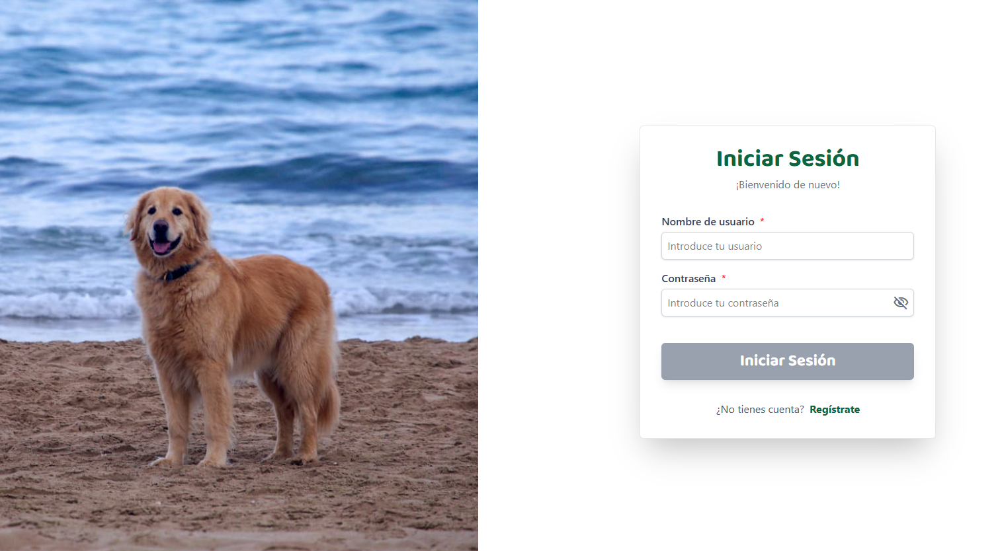
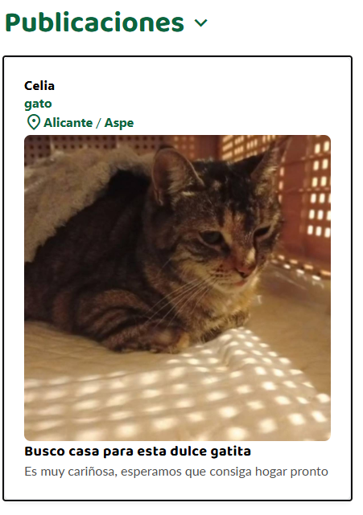
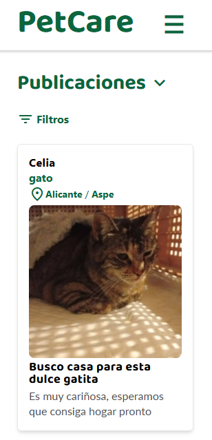
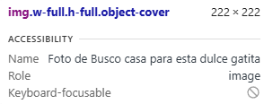
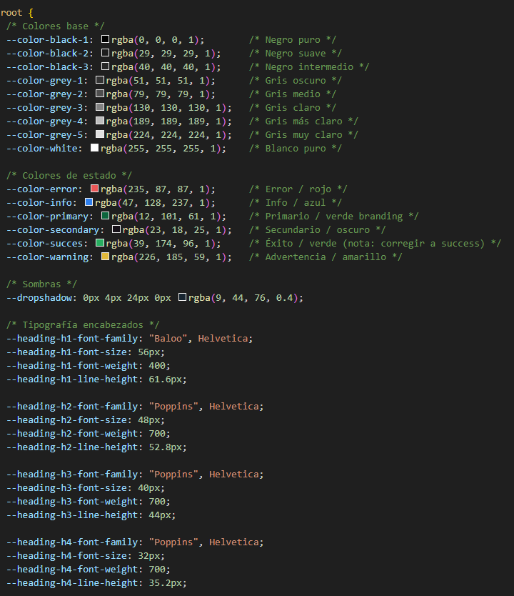

# PetCare – Aplicación Web en React


**URL de la web:** https://pet-care-web-pi.vercel.app

PetCare es una aplicación web desarrollada en **React** (empaquetado con **Vite**) y estilizada con **Tailwind CSS**, conectada a una API REST en Spring Boot.
Permite gestionar publicaciones de adopción, ayuda y extravíos, así como consejos sobre el cuidado de animales.

## Índice
- [Funcionalidades principales](#funcionalidades-principales)
- [Arquitectura de la aplicación](#arquitectura-de-la-aplicación)
- [Tecnologías utilizadas](#tecnologías-utilizadas)
- [Pruebas de usabilidad y accesibilidad](#pruebas-de-usabilidad-y-accesibilidad)

## Funcionalidades principales

### Autenticación
- **Registro de usuario** (con formulario validado y deshabilitado hasta completar).
- **Inicio de sesión**.
- **Mantener sesión iniciada** (guardado en `localStorage`).
- **Edición de datos personales** desde el perfil.
- **Cerrar sesión** con modal de confirmación personalizado.
- **Eliminar cuenta** con redirección al inicio.

### Publicaciones (Posts)
- **Crear post** (Adopción, Ayuda, Extravío).
- **Subir imagen** desde los archivos del ordenador.
- **Filtrar por**:
  - Tipo de publicación (Categoría).
  - Tipo de animal.
  - Ubicación (Provincia y Municipio mediante API externa).
- **Ver detalles completos** del post.

### Consejos
- **Listado de consejos** sobre el cuidado de mascotas.
- **Filtrar por categoría** (Comida, Higiene, Accesorios...).
- **Ver detalles** completos del consejo.

### Perfil
- **Ver publicaciones y consejos creados** por el propio usuario.
- **Eliminar publicaciones** propias con modal de confirmación.

## Arquitectura de la aplicación
La web sigue una arquitectura de separación de responsabilidades muy limpia y modular:

```text
src/
├─ assets/         # Imágenes, iconos y recursos estáticos
├─ components/     # Componentes visuales reutilizables (Card, Form, Modal...)
├─ hooks/          # Lógica de estado y efectos (useAuth, useProfile, usePosts...)
├─ pages/          # Pantallas principales (Home, Login, Profile, NewPost...)
├─ services/       # Peticiones a la API con Axios (userService, postService...)
└─ main.jsx        # Punto de entrada de la aplicación
```

### Beneficios de esta arquitectura
- **Código limpio y mantenible**: La interfaz (UI) está totalmente separada de la lógica de negocio.
- **Lógica reutilizable**: Los hooks personalizados permiten usar la misma lógica en diferentes pantallas sin repetir código.
- **Fácil mantenimiento**: Si la API del servidor cambia de rutas, solo hay que tocar la carpeta `services`.

## Tecnologías utilizadas
- **React**.
- **Vite**.
- **Tailwind CSS**.
- **React Router DOM**.
- **Axios**.
- **Material Symbols**.
- **Vercel**.

---

# Pruebas de usabilidad y accesibilidad 

## Tabulación


## Responsive


## Alt 


## En ciertas partes del código se ha usado Anima para extraer el estilo de un texto


## Menú hamburguesa solo en móvil

